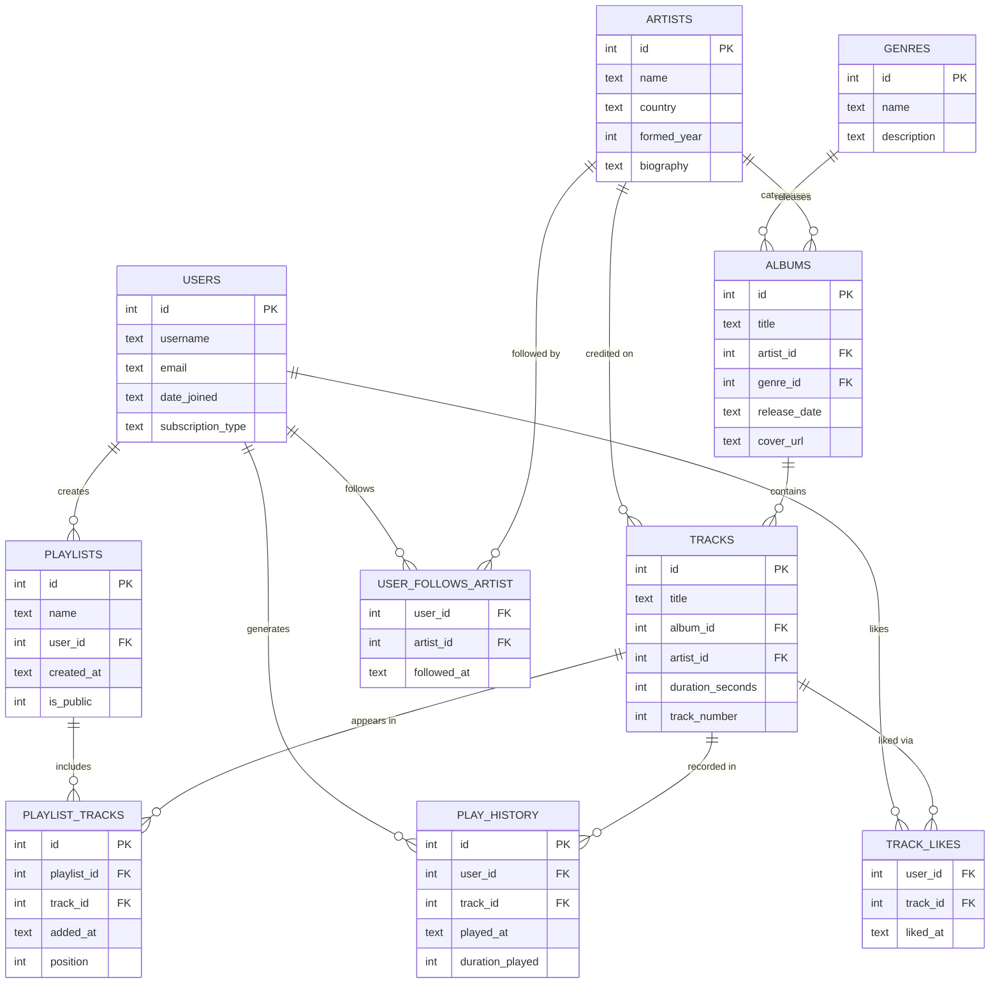

# Design Document

## Melodify — Music Streaming Platform Database

By ascendho

Video overview: [https://youtu.be/PLACEHOLDER](https://youtu.be/PLACEHOLDER)

---

## Scope

### Purpose

Melodify is a relational database that powers the back-end of a music streaming service similar in spirit to Spotify or Apple Music. Its goal is to store and organise every piece of data the platform needs to let users discover music, build playlists, track their listening history, and follow artists — while also giving the platform analytics capabilities (play counts, skip rates, genre preferences).

### What is in scope

- **Music catalogue** — genres, artists, albums, and individual tracks with rich metadata (duration, track ordering, release date, cover art URL).
- **Users** — account details and subscription tier (free / premium / family).
- **Playlists** — user-created collections of tracks, with ordering and public/private visibility.
- **Engagement events** — every stream event (play history) recorded with the exact duration played, enabling skip-rate analytics.
- **Social layer** — users following artists and liking individual tracks.

### What is out of scope

- **Authentication and passwords** — security infrastructure (hashed passwords, OAuth tokens, session management) is handled at the application layer and does not belong in the schema.
- **Payments and billing** — subscription billing, invoices, and payment methods are managed by a dedicated billing service.
- **Podcast and video content** — the schema models audio tracks only; podcasts or music videos require additional entities not included here.
- **Multiple artists per track** — featured artists / collaborations are not modelled; each track has exactly one credited artist for simplicity.
- **Lyrics and audio files** — raw audio storage and lyric metadata are outside scope.

---

## Functional Requirements

### What a user can do

- Search and browse music by genre, artist, album, or track title.
- Stream tracks and have every listen recorded in their personal history.
- Create, rename, reorder, and delete playlists; add or remove tracks from them.
- Like individual tracks and unlike them.
- Follow or unfollow artists.
- View their own activity summary (total streams, liked tracks, playlists, followed artists).

### What is beyond scope

- Real-time audio streaming — this is a database design document, not an application architecture document; the database stores metadata, not audio data.
- Social features between users (friend graphs, shared playlists, messages).
- Recommendation algorithms — the database can surface raw data for a recommender, but the algorithm itself lives in application code.
- Artist/label admin dashboards (royalty reporting, upload interfaces).

---

## Representation

### Entities

The database contains ten tables. The main design choices for each are explained below.

#### `genres`
Stores music genre labels (`id`, `name`, `description`). `name` carries a `UNIQUE` constraint because a genre label must be unambiguous. Keeping genres in a separate lookup table rather than a free-text column on `albums` prevents typos and enables genre filtering without `LIKE` queries.

#### `artists`
Stores (`id`, `name`, `country`, `formed_year`, `biography`). `formed_year` has a `CHECK` constraint (`> 1800`) to reject nonsensical values while still allowing `NULL` for solo performers where the concept of a formation year is not meaningful. `TEXT` was chosen for `country` over a foreign key to an ISO-3166 table to keep the schema self-contained and small.

#### `albums`
Stores (`id`, `title`, `artist_id`, `genre_id`, `release_date`, `cover_url`). `release_date` is stored as `TEXT` in ISO-8601 format (`YYYY-MM-DD`); SQLite has no native `DATE` type, but this format lexicographically sorts correctly. `genre_id` uses `ON DELETE SET NULL` so that removing an obscure genre does not cascade-delete albums. `artist_id` uses `ON DELETE CASCADE` because an album without its artist has no meaning.

#### `tracks`
Stores (`id`, `title`, `album_id`, `artist_id`, `duration_seconds`, `track_number`). Duration is stored as an `INTEGER` (seconds) rather than `TEXT` ("3:26") to allow arithmetic — summing an album's total runtime or computing the fraction of a track that was played. Both `album_id` and `artist_id` carry `ON DELETE CASCADE` because orphaned tracks are not useful.

#### `users`
Stores (`id`, `username`, `email`, `date_joined`, `subscription_type`). `username` and `email` are both `UNIQUE` to prevent duplicate accounts. `subscription_type` is constrained via `CHECK` to the three known tiers; any new tier requires a schema migration — a deliberate choice that prevents bad data from being inserted silently.

#### `playlists`
Stores (`id`, `name`, `user_id`, `created_at`, `is_public`). SQLite lacks a `BOOLEAN` type so `is_public` uses `INTEGER` with a `CHECK` limiting it to `0` or `1`. `created_at` defaults to `DATETIME('now')` so the application layer does not need to supply timestamps.

#### `playlist_tracks`
Junction table linking `playlists` to `tracks` with columns (`id`, `playlist_id`, `track_id`, `added_at`, `position`). The `UNIQUE(playlist_id, track_id)` constraint prevents a track appearing twice in the same playlist. `position` stores the display order explicitly, rather than inferring it from insertion order, so tracks can be reordered without deletion.

#### `play_history`
Records every stream event (`id`, `user_id`, `track_id`, `played_at`, `duration_played`). Storing `duration_played` is the key design decision here — it enables distinguishing a full listen from a skip (industry convention: < 30 seconds = skip), which is valuable for analytics and recommendation signals.

#### `user_follows_artist`
Many-to-many junction table (`user_id`, `artist_id`, `followed_at`) with a composite primary key. `ON DELETE CASCADE` on both foreign keys ensures that deleting a user or an artist automatically cleans up follow relationships.

#### `track_likes`
Similar many-to-many junction (`user_id`, `track_id`, `liked_at`) with a composite primary key. Separated from `play_history` because a "like" is a deliberate curation action, not just a passive event, and they have different access patterns.

### Relationships

The entity relationship diagram below illustrates how these tables connect:

**Key relationships summarised:**

- An **artist** releases zero or more **albums**; each album belongs to exactly one artist and one genre.
- An **album** contains one or more **tracks**; each track belongs to exactly one album and one credited artist.
- A **user** can create many **playlists**; each playlist has an ordered set of tracks via the `playlist_tracks` junction.
- Every time a user streams a track, a row is appended to **play_history** (one-to-many from user, one-to-many from track).
- Users and artists share a many-to-many "follow" relationship; users and tracks share a many-to-many "like" relationship — both modelled as explicit junction tables.

---

## Optimizations

### Indexes

Nine indexes were created to accelerate the most common read patterns:

| Index | Table | Column(s) | Rationale |
|---|---|---|---|
| `idx_albums_artist` | `albums` | `artist_id` | Fetching an artist's discography |
| `idx_tracks_album` | `tracks` | `album_id` | Loading all tracks for an album |
| `idx_tracks_artist` | `tracks` | `artist_id` | Finding all tracks by an artist |
| `idx_history_user` | `play_history` | `user_id` | Retrieving a user's listening history |
| `idx_history_track` | `play_history` | `track_id` | Aggregating play counts per track |
| `idx_pt_playlist` | `playlist_tracks` | `playlist_id` | Loading a playlist's tracks |
| `idx_pt_track` | `playlist_tracks` | `track_id` | Finding which playlists contain a track |
| `idx_follows_user` | `user_follows_artist` | `user_id` | Listing artists a user follows |
| `idx_follows_artist` | `user_follows_artist` | `artist_id` | Counting followers per artist |

Columns that are already primary keys (and thus automatically indexed by SQLite) were not redundantly indexed. The `username` and `email` columns on `users` gain implicit indexes from their `UNIQUE` constraints.

### Views

Three views were created to simplify common query patterns and reduce boilerplate JOIN logic in application code:

1. **`track_details`** — Joins `tracks`, `artists`, `albums`, and `genres` into a single flat view and adds a human-readable `MM:SS` duration field computed with `PRINTF`. This is the view most read queries will use.

2. **`top_tracks`** — Aggregates total play counts and like counts per track. It enables simple `SELECT … FROM top_tracks LIMIT 10` chart queries without the caller needing to write window functions or GROUP BY clauses.

3. **`user_activity_summary`** — Produces per-user statistics (total streams, liked tracks, playlists created, artists followed) from four different tables in a single query. It powers user profile and dashboard screens.

---

## Limitations

### Single primary artist per track
The current schema assigns exactly one artist to each track via `artist_id`. Collaborations (e.g., "Artist A ft. Artist B") cannot be modelled faithfully. A `track_artists` junction table would be needed to support multi-artist credits without breaking the current schema.

### Flat playlist ordering
`position` is stored as a plain integer. Reordering tracks requires updating multiple rows (e.g., incrementing all positions above the insertion point), which can cause write contention on large playlists. A linked-list or fractional-indexing approach would be more efficient but adds complexity.

### Text timestamps in SQLite
Because SQLite has no native `DATETIME` type, all timestamps are stored as `TEXT` in ISO-8601 format. This works for ordering and range queries with standard string comparisons, but timezone handling must be managed entirely by the application layer; the database has no awareness of timezones.

### No soft deletes
Deleting a user, artist, or track physically removes the row and cascades through all dependent tables. In a production system, a `deleted_at` nullable timestamp column would be preferable so that historical records (play history, likes) remain intact for analytics and audit trails even after logical deletion.

### No real-time streaming analytics
`play_history` grows by one row per stream event and is queried with `COUNT(*)` aggregations. For a platform with millions of users this table can become very large; a production system would likely archive older rows to a data warehouse and maintain pre-computed aggregate tables updated by a stream-processing pipeline.

### No content delivery addresses
`cover_url` stores a raw URL string with no validation or CDN management. A production system would integrate with an object-storage service (e.g., S3) and store only the object key, resolving the full URL at request time.